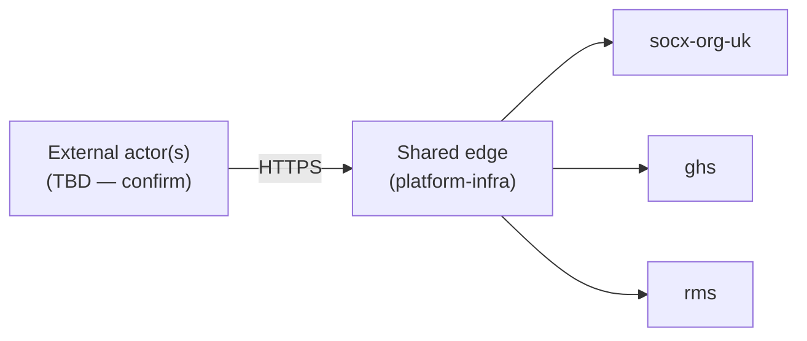
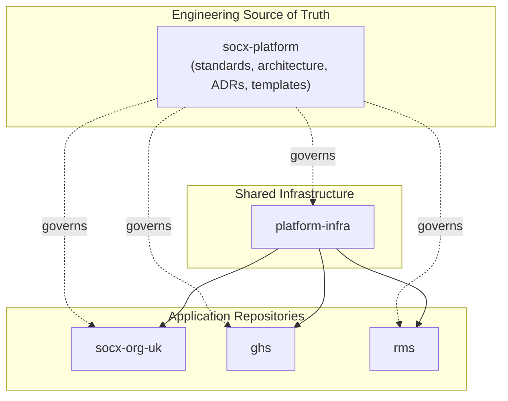

# CTX-010 — Platform Context

## Scope

The boundary of the SOCX platform: which systems are in scope, who or what interacts with them from outside, and why the platform exists. Does not describe how the systems relate to each other internally (see `DOM-010`) or any system's internal design (see `APP-010`).

## Context

`socx-platform` is the engineering source of truth for a small set of related application repositories — `socx-org-uk`, `ghs`, `rms` — fronted by shared infrastructure (`platform-infra`). This document exists so anyone joining the platform can see the whole boundary in one place before going system-by-system.

**Open item:** the business purpose of each system (`socx-org-uk`, `ghs`, `rms`) and the identity of external actors (staff, customers, the public, other services) is not yet recorded anywhere in this repository. The diagram and actor list below are placeholders — confirm and replace before this document is Approved.

## Target Design

Diagram source: `docs/diagrams/CTX-010-platform-context.mmd`.

- All external traffic enters through the shared nginx edge (`platform-infra`), not directly against any application — see `INF-010` for the target topology this implies.
- Each of `socx-org-uk`, `ghs`, and `rms` is a distinct system with its own repository; `socx-platform` itself contains no application code (per the project charter) and is not a runtime participant in this diagram.
- External actors are not yet enumerated — this needs input on who/what actually calls these systems (end users, internal staff, other automated services) before the diagram is more than a placeholder.

### Repository Relationships

Diagram source: `docs/diagrams/CTX-010-repository-relationships.mmd`.

This is a different lens from the traffic diagram above: it shows repository-level, not runtime, relationships. `socx-platform` is not a runtime participant (dotted "governs" edges) — it defines the standards and architecture the other repositories follow. `platform-infra` is the shared runtime edge (solid edges) fronting the three application repositories, consistent with `INT-010` and `INF-010`.

## Current-State Gap

Not yet assessed — no corresponding `docs/current-state/` document exists yet to compare against.

## Related Documents

- Standards: `OPS-010` (environment boundary implied by the shared edge)
- ADRs: `ADR-020`, `ADR-050`, `ADR-140`
- Reference Implementations: `reference/deployment`, `reference/nginx` (both **Approved**, verified on-host)
- Runbooks: none yet
- Current-State documentation: none yet

## Revision History

| Version | Date | Change | Author |
|---|---|---|---|
| 0.1 | 2026-07-13 | Initial draft | Socx |
| 1.0 | 2026-07-13 | Approved | Socx |
| 1.1     | 2026-07-14 | Added ADR cross-references | Socx   |
