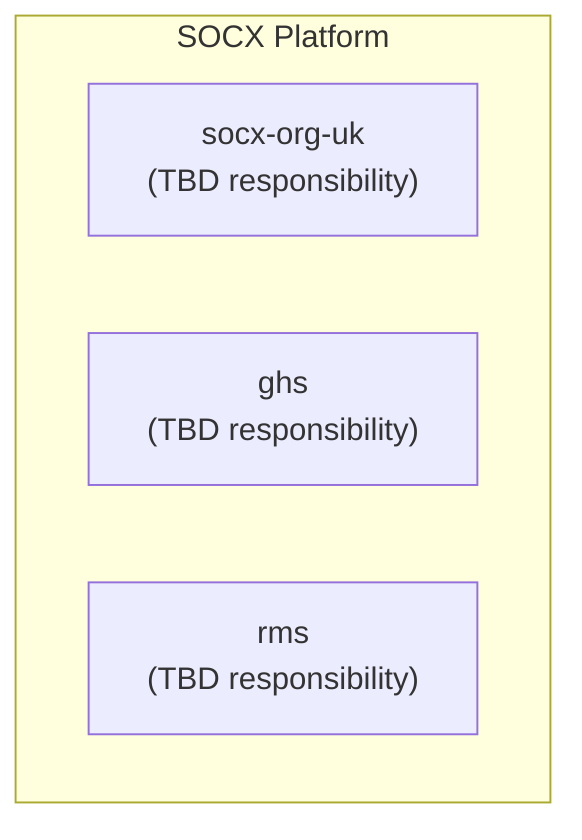

# DOM-010 — System Landscape

## Scope

Which systems make up the SOCX platform, what each is responsible for, and how they relate to each other. Does not describe any system's internal component design (see `APP-010`, and each system's own repository) and does not describe shared hosting infrastructure as a "system" — `do-nginx-infra` is infrastructure, covered under `INF-010`/`TEC-010`, not a business system listed here.

## Context

As the platform grows past a single application, an explicit landscape view prevents responsibility from silently overlapping between systems (e.g. two systems each becoming an accidental source of truth for the same data — see `DAT-010`).

**Open item:** the actual responsibility of `ghs` and `rms` is not yet documented anywhere in this repository. The table below is a placeholder structure, not a confirmed description — fill in before Approval.

## Target Design

Diagram source: `docs/diagrams/DOM-010-system-landscape.mmd`.

| System | Responsibility | Depends on | Data owned |
|---|---|---|---|
| `socx-org-uk` | TBD — confirm | TBD | TBD |
| `ghs` | TBD — confirm | TBD | TBD |
| `rms` | TBD — confirm | TBD | TBD |

Once responsibilities are confirmed, any relationship between two systems (a dependency, a shared data need) should be reflected as an edge in the diagram and a row above — not described only in prose, so the landscape stays a single, current source of truth (per `ENG-050`'s repository-per-concern principle, applied here at the platform level).

## Current-State Gap

Not yet assessed.

## Related

- Standard(s) this design satisfies: `ENG-050`
- ADR(s) behind this design: none yet
- Reference implementation(s): none
- Runbook(s): none yet

## Revision History

| Version | Date | Change | Author |
|---|---|---|---|
| 0.1 | 2026-07-13 | Initial draft | Socx |
