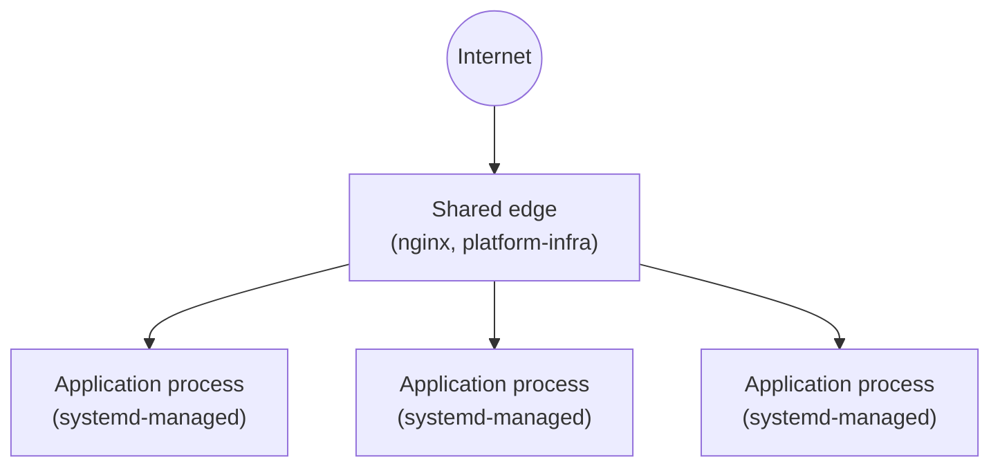

# INF-010 — Target Infrastructure Topology

## Scope

The target hosting and networking shape of the platform, conceptually. This document MUST NOT contain deployment configuration, connection strings, ports, hostnames, or IP addresses — that detail belongs in `reference/` and each project's own deployment configuration, never here.

## Context

Every project needs to fit a known deployment shape rather than each inventing its own hosting arrangement — this is what lets `OPS-010` (environment tiers) and `OPS-020` (infrastructure as code) be meaningful platform-wide rules rather than per-project guesses.

## Target Design

Diagram source: `docs/diagrams/INF-010-target-infrastructure-topology.mmd`.

- A single shared edge (nginx, per `reference/nginx`) terminates all external traffic and routes to application processes — no application is directly internet-facing.
- Each application process is managed by systemd (per `reference/systemd`), not run ad hoc — this is what makes `OPS-030`'s rollback requirement and `OPS-040`'s health-check requirement mechanically achievable.
- Environment tiers (per `OPS-010`) are separate deployment targets of this same shape, not a variation on it — non-production and production both follow this topology, differing only in scale and data.
- All of the above is defined as code per `OPS-020`; this document explains *why* the shape looks like this, `reference/deployment` and each project's own deploy configuration hold the *how*.

## Current-State Gap

See `CS-INF-020`: the target topology (shared edge → systemd-managed processes) is largely realised on the rebuilt droplet — nginx, the runtime substrate, and per-app systemd scaffolding are all in place and verified (Bootstrap Phases B0–B5). Not yet built: SOCX-specific nginx site configuration, TLS, application deployment itself, and the second environment tier (`OPS-010.1` exception, `ADR-180`).

## Related Documents

- Standards: `OPS-010`, `OPS-020`
- ADRs: `ADR-040`, `ADR-050`, `ADR-100`, `ADR-130`, `ADR-140`, `ADR-160`, `ADR-180`
- Reference Implementations: `reference/systemd`, `reference/nginx` (both Approved, verified on-host 2026-08-06); `reference/deployment` (Approved, verified on-host 2026-08-07)
- Runbooks: none yet
- Current-State documentation: `CS-INF-020`

## Revision History

| Version | Date | Change | Author |
|---|---|---|---|
| 0.1 | 2026-07-13 | Initial draft | Socx |
| 1.0 | 2026-07-13 | Approved | Socx |
| 1.1     | 2026-07-14 | Added ADR cross-references | Socx   |
| 1.2 | 2026-07-15 | Added ADR-180 cross-reference | Socx |
| 1.3 | 2026-08-06 | reference/systemd moved to Approved; Current-State Gap assessed against CS-INF-020 (Bootstrap Phases B0-B5) | Socx |
| 1.4 | 2026-08-06 | reference/nginx moved to Approved (on-host deployment: real certificates, full site configs, canary-proven) | Socx |
