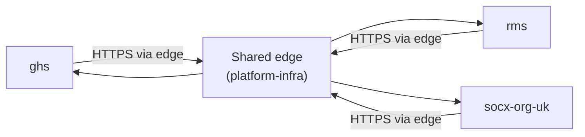

# INT-010 — Integration Architecture

## Scope

How SOCX systems communicate with each other: default style and contract conventions. Does not define any specific endpoint or event schema — those belong in the owning system's own repository, linked back here for the convention they follow.

## Context

With three systems and growing, ad hoc point-to-point integration (each pair inventing its own protocol) becomes expensive to reason about and secure. A single default integration style keeps that cost flat as more systems are added.

## Target Design

Diagram source: `docs/diagrams/INT-010-integration-architecture.mmd`.

- **Default style:** synchronous HTTPS, routed through the shared edge (`platform-infra`, see `INF-010`) rather than direct system-to-system network access. This keeps every integration point visible in one place instead of a private mesh of internal routes.
- **Contracts:** an endpoint one system exposes for another to call is versioned in its path or header, and a breaking change requires a new version rather than an in-place change — consumers are not expected to update in lockstep with the provider.
- **No shared databases:** systems do not integrate by reading each other's data stores directly — see `DAT-010`'s ownership rule. Integration happens through the interface layer defined in `APP-010`, never the data access layer.
- **Asynchronous/event-driven integration** is not yet in scope — at the platform's current size, synchronous calls through the shared edge are sufficient. This should be revisited (and recorded as an ADR) if a use case genuinely needs decoupled, event-driven communication rather than being added quietly.

## Current-State Gap

Not yet assessed.

## Related Documents

- Standards: `ENG-040`
- ADRs: `ADR-050`, `ADR-080`, `ADR-100`, `ADR-110`
- Reference Implementations: `reference/nginx` (Approved, verified on-host 2026-08-06)
- Runbooks: none yet
- Current-State documentation: none yet

## Revision History

| Version | Date | Change | Author |
|---|---|---|---|
| 0.1 | 2026-07-13 | Initial draft | Socx |
| 1.0 | 2026-07-13 | Approved | Socx |
| 1.1     | 2026-07-14 | Added ADR cross-references | Socx   |
