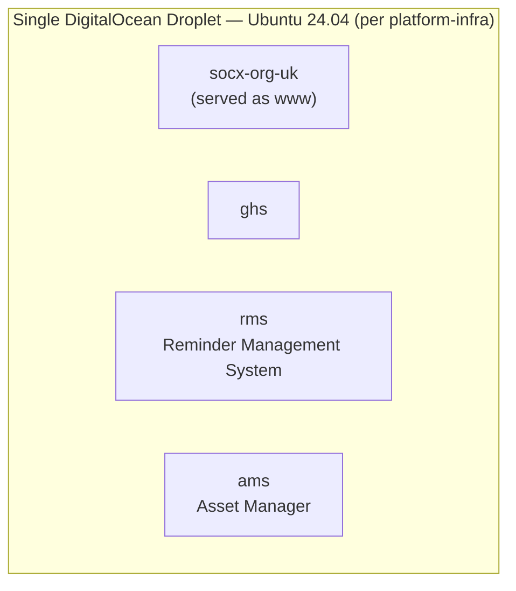

# CS-DOM-010 — Current System Landscape

## Scope

Which systems are actually deployed and live right now, and how they actually relate. Does not describe intended systems or relationships (see `DOM-010`).

## Method

`git` inspection of each repository (remote, branch, commit history) plus direct reading of `platform-infra`'s `deployment-architecture.md`, nginx site files, and systemd service files. See `REP-010` for the full repository-location evidence.

## Inventory

| System                    | Responsibility (as self-declared)                                     | Depends on                                                                                         | Data owned (Observed)                                                       | Evidence |
| ------------------------- | --------------------------------------------------------------------- | -------------------------------------------------------------------------------------------------- | --------------------------------------------------------------------------- | -------- |
| `socx-org-uk` (`www`) | Org public website; Express API + React/Vite web + worker             | Shared droplet, shared nginx edge                                                                  | Unknown — no dedicated DB dependency found in its`package.json`          | Observed |
| `ghs`                   | Golf handicap tracking (rounds, players, handicap calculation)        | PostgreSQL, Redis (per its`apps/api/package.json`)                                               | Its own Postgres DB (name unconfirmed)                                      | Observed |
| `rms`                   | Reminder-centred notification platform; dispatch engine               | PostgreSQL 16, Prisma; a**separate Python 3.12 + APScheduler worker** alongside its Node API | Its own Postgres DB (`rms_db`, per its README's quick-start instructions) | Observed |
| `ams`                   | Asset management (uploads, documents, asset-ownership access control) | PostgreSQL, Redis (BullMQ)                                                                         | Its own Postgres DB (name unconfirmed)                                      | Observed |

All four applications currently run on the **same single droplet**, per `platform-infra`'s architecture document — there is no evidence of per-system or per-environment infrastructure isolation today (see `CS-INF-010`).

**Notable, well-evidenced fact:** `ams`'s own documentation (`docs/asset-manager.md`) explicitly states it borrowed technology and structural patterns from `rms` ("Patterns Borrowed from RMS"). This is real precedent for a shared application pattern (the concern `APP-010` formalizes) existing organically before `APP-010` was written.

**Unknown:** exact current data ownership boundaries between systems (e.g. whether any system reads another's database directly, which `INT-010`/`DAT-010` forbid as a target) — no cross-database access was found in the manifests reviewed, but this was not exhaustively verified against actual running configuration or code.

## Gap vs. Target Architecture

| Aspect                 | Current State                                                    | Target (`DOM-010`)                                            | Difference                                                                                               | Impact                                                                                                                                                               |
| ---------------------- | ---------------------------------------------------------------- | --------------------------------------------------------------- | -------------------------------------------------------------------------------------------------------- | -------------------------------------------------------------------------------------------------------------------------------------------------------------------- |
| System count           | 4 systems, all independently confirmed deployed                  | 3 systems named, all marked "TBD — confirm" for responsibility | `ams` missing entirely; the other three's responsibilities are now confirmable facts, not placeholders | `DOM-010` should be revisited using this inventory as source material — recommended, not performed here (would require editing an Approved architecture document) |
| Responsibility clarity | High — each system's purpose is self-declared in its own README | Unconfirmed placeholders                                        | Current state is now more complete than the target document                                              | Low risk, but an oddity worth resolving: the "as-is" is currently more informative than the "to-be" for this aspect                                                  |

## Related Documents

- Architecture: `DOM-010`
- Standards: `ENG-050`
- ADRs: none yet
- Reference Implementations: none
- Runbooks: none yet

## Revision History

| Version | Date       | Change        | Author |
| ------- | ---------- | ------------- | ------ |
| 0.1     | 2026-07-13 | Initial draft | Socx   |
| 1.0     | 2026-07-13 | Approved      | Socx   |
